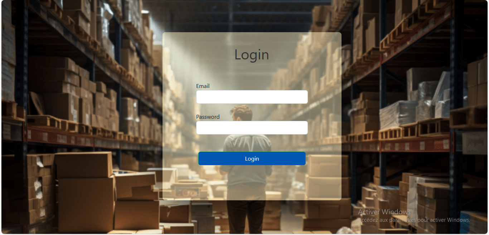

# Stock Management
A stock management application is a software tool designed to help businesses efficiently manage their inventory or stock of goods

# Requirement
Python 3.6.9, virtualenv, mysql

# Installation
Create Mysql DataBase
```
$ cat setup_mysql.sql | sudo mysql -hlocalhost -uroot -p
```
Before procedding the the installation you should install virtualenv and create a new dev environement. After that switch to your new environement and install all the project requirements
```
$ pip install -r requirements.txt
```
Set the FLASK_APP environment variable
```
$ export FLASK_APP=app.py
```
init : to initialize almebic migration. migrate: to generate the migration file. upgrade: run the migration file and create the tables.
```
flask db init
flask db migrate
flask db upgrade
```
Switch to the flask shell to create an admin user.
```
flask shell
```
In the flask shell import User model and db, and initialize a new user object and make the user admin
```
>>> import bcrypt
>>> from Stock.models import User
>>> from Stock import db
>>> password = "password123"
>>> hashed_password = bcrypt.hashpw(password.encode('utf-8'), bcrypt.gensalt())
>>> admin = User(username="aichaAdmin", email="aicha@admin.ma", password=hashed_password, phone="0612345678")
>>> admin.is_admin = True
>>> db.session.add(admin)
>>> db.session.commit()
```
Run the app
```
flask run
```
If everything went smoothly the app should be running on http://127.0.0.1:5000/